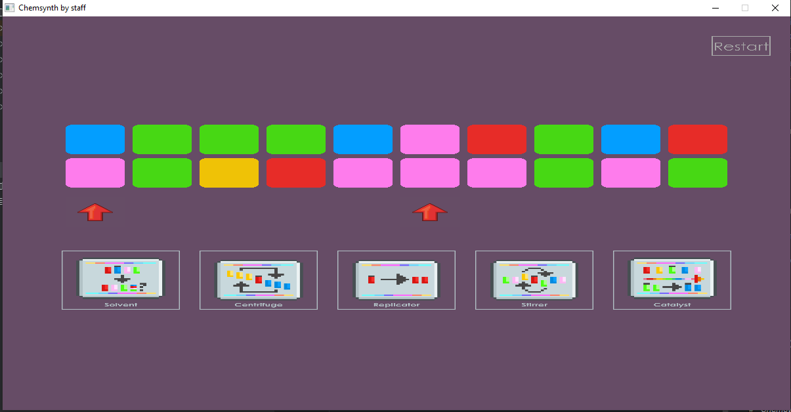

# 🧪 Chemsynth

**Chemsynth** is an interactive chemistry puzzle game designed to help players **practice and sharpen their chemistry skills** in a fun, visual way. Built with **C++**, **OpenGL**, and **GLFW**, the game combines problem-solving with interactive gameplay, where players arrange, connect, and manipulate chemical “boxes” to solve synthesis challenges.

---

## 🎮 Game Overview

The game presents chemistry-themed puzzles, where you must match, synthesize, or arrange chemical components correctly.

Color Matching Mode (inspired by Growtopia’s Chemical Conundrum):

You are given a grid of colored boxes.
The goal is to match the colors of boxes below with the ones above.
When all boxes are aligned correctly, you solve the puzzle.
This mode adds a fast, casual mini-game alongside the main chemistry challenges.
A real-time solver runs in the background, allowing the game to provide hints or check puzzle solvability.
When you complete the synthesis or color-matching puzzle correctly, you win the round!

---

## ✨ Features

- 🖥️ **Cross-platform C++/OpenGL game**
- 🔬 **Chemistry practice** through puzzle solving
- 🎨 **Simple UI with colored boxes** (upper and lower layers match in color)
- 🖱️ **Mouse-driven gameplay** (click, drag, interact with boxes)
- 🧩 **Solver engine** running in parallel to simulate or check solutions
- 🚀 Lightweight and dependency-minimal (GLFW, GLAD, Nuklear, stb, etc.)

---

## 🛠️ Installation & Build

### Prerequisites

Make sure you have the following installed:
- **CMake** (>= 3.10)
- **C++17 compatible compiler** (GCC, Clang, or MSVC)
- **Dependencies** (already bundled in `glfw/` and `deps/` folder):
    - [GLFW](https://www.glfw.org/) – window & input handling
    - [GLAD](https://glad.dav1d.de/) – OpenGL loader
    - [Nuklear](https://github.com/vurtun/nuklear) – lightweight GUI
    - [stb_image_write](https://github.com/nothings/stb) – image output support

### How to Play

Compile and run `main.cpp`.
---

## 🎮 Controls

- **Mouse** – interact with chemical boxes, buttons, and arrows
- **Left Click** – select / place / interact
- **Gameplay flow:**
    1. Start the puzzle (chemistry quiz appears).
    2. Manipulate the boxes to match the target synthesis.
    3. Use visual cues (borders, arrows, and color-matched boxes).
    4. Win when your arrangement matches the target quiz.

---

unsolved puzzle:

---

## 🤝 Contributing

Contributions are welcome!
- Fork the repo
- Create a feature branch
- Submit a pull request

---

## 📜 License

This project is licensed under the **MIT License**. See [LICENSE](LICENSE) for details.

---

⚗️ *Chemsynth – turning chemistry practice into interactive play.*  
